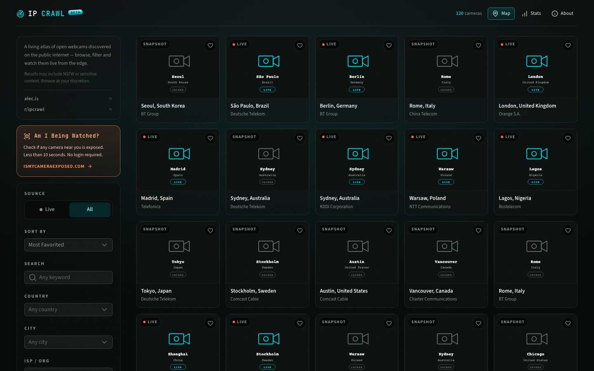

# IP Crawl ([ipcrawl.com](https://ipcrawl.com))

**A filterable catalog and live-preview surface for open webcams discovered
through public internet intelligence.**

<p align="center">
  
</p>

---

## What is IP Crawl?

IP Crawl surfaces open webcam data discovered through public internet
intelligence sources (currently [Shodan](https://www.shodan.io/)). It provides:

- **Catalog** at `/`, "Explore" — browse thousands of cameras by country, city,
  organization, manufacturer, liveness, or free-text search. Open any camera for
  a larger live or still preview.
- **Fun Mode** at `/fun` — a CRT-styled random channel viewer with Guess Mode,
  screensaver, live-only filtering, and shareable channel URLs (`/fun/c/[id]`). This was the original POC.
- **Map** at `/map` — a spatial view of camera locations with clustered markers.
- **Stats** at `/stats` — aggregate metrics and a 12-month trend chart.
- **API** at `/api` — documentation for the public API (one CORS-open endpoint so far).
- **"Is My Camera Exposed?"** at `/imce` — a consumer-facing scan that checks
  whether a visitor's IP appears in the catalog, [ismycameraexposed.com](https://www.ismycameraexposed.com).

This project has a mission to secure all open webcams and bring the total number of open webcams to zero. Read more about the mission [here](https://ipcrawl.com/about).

## Tech Stack

| Layer | Technology |
|-------|-----------|
| Framework | [Nuxt 4](https://nuxt.com/) (Vue 3.5, Nitro 2) |
| Styling | [Tailwind CSS 4](https://tailwindcss.com/) + [Nuxt UI 4](https://ui.nuxt.com/) |
| Icons | [Iconify](https://iconify.design/) (Lucide + Simple Icons) |
| Maps | [Leaflet](https://leafletjs.com/) |
| Markdown | [marked](https://marked.js.org/) |
| Runtime | Node.js (VPS, systemd + nginx) |
| Storage | SQLite (node:sqlite) + filesystem |
| Testing | [Playwright](https://playwright.dev/) (E2E) |
| CI | GitHub Actions |

## Quick Start

```bash
# Clone and install
git clone https://github.com/iptv-crawler/ipcrawl.git
cd ipcrawl
pnpm install

# Configure your Shodan API key
cp .env.example .env
# Edit .env — add your NUXT_SHODAN_API_KEY

# Start the dev server (local SQLite)
pnpm run dev
```

The dev server runs at `http://localhost:3000`. Storage defaults to the local
filesystem (`./.data/`), so you can browse the catalog locally.

### Environment Variables

| Variable | Default | Description |
|----------|---------|-------------|
| `NUXT_SHODAN_API_KEY` | — | Shodan API key (required for camera refreshes) |
| `NUXT_SHODAN_LIMIT_PER_QUERY` | `1500` | Max cameras per Shodan query page |
| `NUXT_EDGE_KILL_SWITCH` | `false` | Emergency brake — skips live probes, serves cached screenshots |
| `NUXT_OFFLINE_FOR_NOW` | `false` | Redirect all traffic to an overload page |
| `NUXT_ENABLE_LIVE_PROBE` | `false` | Enable live camera frame fetching |

## Architecture

```
app/             Root app shell, global theme, error pages
├── layers/
│   ├── explore/   Catalog UI at / (grid, sidebar, dialog)
│   ├── fun/       CRT roulette at /fun (random channel viewer)
│   ├── imce/      "Is My Camera Exposed?" scan at /imce
│   └── map/       Map explorer at /map
├── server/        Shared Nitro handlers, camera ingestion, live probing
├── shared/        API contracts (shared between client & server)
└── migrations/    Database migrations
```

### Key API Routes

| Route | Description |
|-------|-------------|
| `GET /api/explore/cams` | Paginated catalog list (SWR 30s) |
| `GET /api/explore/facets` | Cross-filtered facet counts (SWR 10m) |
| `GET /api/explore/cams/[id]` | Single camera detail |
| `POST /api/explore/favorite/[id]` | Per-IP deduped favorite vote |
| `GET /api/explore/thumb/[id].jpg` | Cached still thumbnail |
| `GET /api/cam` | Random camera for Fun mode (uncached) |
| `GET /api/ip` | Public, CORS-open exposure check for the requesting IP (browser-cached 5 min) |
| `GET /api/live/[id].jpg` | Live frame proxy with screenshot fallback |
| `GET /api/status` | Refresh diagnostics |

### Refresh Pipeline

A scheduled task (`server/tasks/cams/refresh.ts`) runs daily at 00:00 UTC:

1. Scrub cached cameras against a blocklist
2. Query Shodan REST API (paginated)
3. Dedupe by `ip:port`, drop blocked rows
4. Write screenshot bytes to filesystem
5. Upsert metadata into SQLite
6. Prune stale rows past the retention window

## Deployment

```bash
pnpm run build
node .output/server/index.mjs
```

See `deploy/` for the full VPS provisioning scripts (systemd unit, nginx
config, backup timer).

## Contributing

We welcome contributions! Please read **[CONTRIBUTING.md](./CONTRIBUTING.md)**
before opening a pull request.

### Key Rules

1. **Human-operated accounts only** — bot accounts, AI-agent accounts, and
   automated scripts are not permitted to contribute. This is enforced in CI.

2. **Behavior-only test coverage required** — every PR that changes application
   code must include at least one Playwright E2E spec or API integration spec
   that exercises the changed behavior.

3. **Open an issue first** for anything beyond a trivial fix.

### Running Tests

```bash
pnpm run lint          # ESLint
pnpm run typecheck     # TypeScript type checking
pnpm run test:e2e      # Playwright E2E tests
pnpm run test:e2e:ui   # Playwright with interactive UI
```

All checks must pass before a PR can be merged. The CI runs lint, typecheck,
E2E tests, human-account verification, and behavior-test coverage checks on
every PR.

## License

[MIT](./LICENSE) © Alec Armbruster
